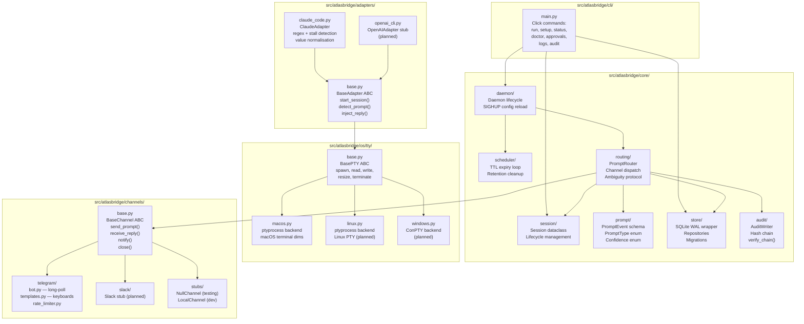

# AtlasBridge Architecture

**Version:** 0.2.0
**Status:** Reference
**Last updated:** 2026-02-21

---

## Table of Contents

1. [Overview](#1-overview)
2. [System Diagram](#2-system-diagram)
3. [Component Architecture](#3-component-architecture)
4. [PTY Supervisor](#4-pty-supervisor)
5. [Tri-Signal Prompt Detector](#5-tri-signal-prompt-detector)
6. [Prompt State Machine](#6-prompt-state-machine)
7. [Multi-Session Routing](#7-multi-session-routing)
8. [Channel Abstraction](#8-channel-abstraction)
9. [Adapter Abstraction](#9-adapter-abstraction)
10. [Observability and Audit](#10-observability-and-audit)
11. [Integrity Invariants](#11-integrity-invariants)
12. [Security Model](#12-security-model)
13. [Technology Stack](#13-technology-stack)

---

## 1. Overview

AtlasBridge is the autonomous runtime for AI developer agents with human oversight. It sits transparently between the operator and an AI coding agent running in a terminal, intercepting every moment the agent pauses and waits for human input, forwarding that pause to a mobile channel, and relaying the human's decision back into the process's standard input. Execution resumes without the operator ever returning to their desk.

The core loop is narrow by design. When `atlasbridge run claude` is invoked, AtlasBridge spawns the AI CLI inside a POSIX pseudoterminal (PTY), so the wrapped process receives a genuine terminal environment — full colour, readline, cursor control, and resize signals — indistinguishable from a normal interactive session. A set of four concurrent asyncio tasks continuously reads the PTY output stream, forwards every byte to the host terminal, and feeds the content through a tri-signal prompt detector. When the detector fires with sufficient confidence that the process is waiting for input, AtlasBridge serialises a `PromptEvent` to its local SQLite store, sends a formatted message with an inline keyboard to Telegram, and enters an awaiting state. The operator taps a button or types a reply on their phone. The reply traverses Telegram's API back to the long-polling bot running on the local machine, is validated against the pending prompt's nonce and TTL, and is injected as raw bytes into the PTY's master file descriptor. The child process reads those bytes from its standard input and continues running.

AtlasBridge does not classify operations as dangerous, block tool calls, parse agent intent, or enforce policy. It is a relay with correctness invariants: the right reply reaches the right prompt, exactly once, only from an authorised identity, before the prompt's TTL expires. Those invariants are implemented through atomic database transitions, per-session injection locks, one-time nonces, and an allowlist of Telegram user IDs. They are correctness mechanisms, not a security posture claim.

---

## 2. System Diagram

The following diagram shows the complete forward and return paths for a single prompt/reply cycle. The Session Manager and Store are cross-cutting: every component that transitions state reads from or writes to them.


**Forward path (prompt):** AI CLI Tool → PTY Supervisor → Prompt Detector → Prompt Router → Telegram Bot → Telegram API → User Phone.

**Return path (reply):** User Phone → Telegram API → Telegram Bot → Reply Receiver → Injection Gate → PTY Supervisor → AI CLI Tool.

---

## 3. Component Architecture



The package is structured so that the `core/` layer has zero knowledge of specific channels or adapters. Dependencies flow inward: `channels/` and `adapters/` depend on `core/`, never the reverse.

---

## 4. PTY Supervisor

### 4.1 PTY / ConPTY Wrapping

On macOS and Linux, AtlasBridge uses `ptyprocess.PtyProcess.spawn()` to launch the child process inside a pseudoterminal pair. The supervisor holds the master file descriptor; the child process holds the slave. Before spawning, AtlasBridge calls `os.get_terminal_size()` to capture the current host terminal dimensions and passes them to `ptyprocess` so the child sees an accurate `TIOCGWINSZ` response. The host terminal is then placed into raw mode (`tty.setraw(sys.stdin.fileno())`) so that all bytes — including control sequences, escape codes, and Ctrl-key events — pass through unmodified. On exit or crash, `termios.tcsetattr` restores the saved terminal attributes.

On Windows (planned), AtlasBridge will use the ConPTY API (`kernel32.CreatePseudoConsole`) through a thin C extension or the `winpty` library. The PTY base class (`BasePTY`) is already defined so that swapping in a ConPTY backend requires only a new `src/atlasbridge/os/tty/windows.py` implementation.

### 4.2 Async Event Loop: Four Concurrent Tasks

`atlasbridge run <tool>` starts a single `asyncio` event loop. Four tasks run concurrently inside that loop for the lifetime of the session:

```
┌──────────────────────────────────────────────────────────────┐
│  asyncio event loop                                          │
│                                                              │
│  Task 1: pty_reader         Reads PTY master fd              │
│           │                 → forwards to host terminal      │
│           └──────────────► → feeds PromptDetector           │
│                                                              │
│  Task 2: stdin_relay        Reads host stdin                 │
│           └──────────────► → writes to PTY master fd        │
│             (paused while injection gate is held)            │
│                                                              │
│  Task 3: stall_watchdog     Fires after N seconds silence    │
│           └──────────────► → triggers blocking heuristic    │
│                                                              │
│  Task 4: response_consumer  Blocks on asyncio.Queue          │
│           └──────────────► → validates + injects reply      │
└──────────────────────────────────────────────────────────────┘
```

**pty_reader** polls the PTY master fd using `select.select` with a 50 ms timeout (non-blocking). Each chunk is written verbatim to host stdout and appended to a bounded circular buffer of configurable size (default 4096 bytes). After each chunk, the buffer is passed to `PromptDetector.detect()`.

**stdin_relay** reads bytes from host stdin and writes them to the PTY master fd. It is suspended (yields on an `asyncio.Event`) whenever the injection gate is acquired, preventing user keystrokes from interleaving with injected reply bytes.

**stall_watchdog** maintains a timestamp of the last byte received from the PTY. It wakes every 500 ms and checks whether `now - last_byte_ts > stuck_timeout_seconds` (default 2.0 s). If so, and no pattern-based detection has already fired, it emits a `PromptEvent` with `Confidence.LOW` and type `TYPE_UNKNOWN`.

**response_consumer** blocks on `asyncio.Queue[tuple[str, str]]` carrying `(prompt_id, normalised_value)`. When a tuple arrives (placed there by the Telegram bot's callback handler), it acquires the injection gate, writes the reply bytes, releases the gate, and updates the database record.

### 4.3 ANSI-Aware Output Handling

The `PromptDetector` always operates on ANSI-stripped text. Before any pattern matching, the rolling buffer is passed through a lightweight ANSI escape sequence stripper (regex-based, handles `ESC[...m`, `ESC[...A/B/C/D`, and OSC sequences) to remove colour codes, cursor movement instructions, and terminal title sequences. Pattern matching runs on the stripped text; the original bytes are forwarded to the host terminal unmodified.

### 4.4 Injection Gate

The injection gate is a per-session `asyncio.Lock`. Its contract:

1. `response_consumer` acquires the lock before writing any bytes to the PTY master fd.
2. While the lock is held, `stdin_relay` is suspended via an `asyncio.Event` cleared at lock acquisition and set at release.
3. After the inject bytes are written, the supervisor sleeps for a brief suppression window (default 150 ms) before releasing the lock. This window prevents the echoed inject bytes from being re-detected as a new prompt.
4. The output buffer is cleared at the start of the suppression window so that the injected characters do not remain in the rolling buffer for the next `PromptDetector` cycle.

The gate guarantees that at most one injection is in-flight at any time and that the human operator's own keystrokes never race with an injected reply.

### 4.5 Bounded Buffer Strategy

The rolling output buffer is a circular byte buffer. New bytes overwrite the oldest when the buffer is full. The default capacity is 4096 bytes, configurable via `buffer_size_bytes` in `~/.atlasbridge/config.toml`. The circular design ensures that the buffer always holds the most recent N bytes of output — the portion most likely to contain the active prompt — without requiring allocation of unbounded memory during long-running sessions.

### 4.6 Prompt/Reply Cycle — Sequence Diagram


---

## 5. Tri-Signal Prompt Detector

The `PromptDetector` class combines three independent signals and emits a `PromptEvent` when the aggregate confidence exceeds the configured threshold (default 0.65).

### 5.1 Signal 1 — Pattern Matching (Confidence: HIGH)

The primary detection mechanism. The ANSI-stripped rolling buffer is matched against a table of compiled regular expressions grouped by `PromptType`. Each match group has a base confidence; additional simultaneous matches within the same buffer window add an increment (0.05 per extra match, capped at 0.99).

| PromptType | Example Patterns | Base Confidence |
|---|---|---|
| `TYPE_YES_NO` | `(y/n)`, `[Y/n]`, `(yes/no)`, `Press 'y' to continue`, `Enter y or n` | 0.90 |
| `TYPE_CONFIRM_ENTER` | `Press Enter to continue`, `[Press Enter]`, `-- More --`, `Hit enter` | 0.85 |
| `TYPE_MULTIPLE_CHOICE` | `^\s*\d+[).]\s+\S+`, `Enter choice \[1-\d\]`, `Select option` | 0.80 |
| `TYPE_FREE_TEXT` | `Password:`, `API key:`, `Enter commit message:`, bare `> ` | 0.65 |

All patterns are evaluated case-insensitively against the stripped text. Choices for `TYPE_MULTIPLE_CHOICE` are extracted using `re.findall(r"^\s*(\d+)[).]\s+(.+)$", text, re.MULTILINE)` and attached to the `PromptEvent` as a list of `(number, label)` tuples (up to 9 options).

**Confidence classification: HIGH.** When pattern matching fires, the event enters the state machine with confidence `HIGH`. No ambiguity protocol is triggered.

### 5.2 Signal 2 — TTY Blocked-on-Read Inference (Confidence: MED)

Reserved as a future enhancement. The design intent is to use `asyncio` subprocess monitoring to detect when the child process is blocked in a `read()` system call on its controlling TTY. On Linux this is observable via `/proc/<pid>/wchan` (value `read_chan` or `tty_read`). On macOS, `proc_pidinfo` with `PROC_PIDTHREADINFO` can surface similar information. When this signal fires without a concurrent Pattern match, it emits a `PromptEvent` with confidence `MED` and type `TYPE_UNKNOWN`.

**Confidence classification: MED.** Triggers the ambiguity protocol if no Pattern signal has already fired for the same buffer snapshot.

### 5.3 Signal 3 — Time-Based Fallback (Confidence: LOW)

Implemented by `stall_watchdog`. If the child produces no PTY output for `stuck_timeout_seconds` (default 2.0 s) and the buffer ends with a non-empty, non-whitespace line, the watchdog emits a `PromptEvent` with type `TYPE_UNKNOWN`. This catches prompts that produce no text matching any known pattern — for example, a bare cursor with no label, or a custom interactive menu that uses raw cursor positioning.

**Confidence classification: LOW.** Always triggers the ambiguity protocol.

### 5.4 PromptEvent Schema

```python
@dataclass
class PromptEvent:
    prompt_id:       str            # UUID v4
    session_id:      str            # UUID v4 of the parent session
    type:            PromptType     # see enum below
    confidence:      Confidence     # see enum below
    excerpt:         str            # ANSI-stripped, truncated to 200 chars
    choices:         list[tuple[str, str]]  # for TYPE_MULTIPLE_CHOICE
    constraints:     dict[str, Any] # e.g. {"max_length": 200}
    idempotency_key: str            # SHA-256(session_id + excerpt + timestamp_bucket)
    timestamp:       datetime       # UTC, microsecond precision
    safe_default:    bytes          # bytes injected on timeout
    expires_at:      datetime       # UTC (timestamp + timeout_seconds)
    nonce:           str            # secrets.token_hex(16), single-use
```

### 5.5 PromptType Enum

```python
class PromptType(str, enum.Enum):
    TYPE_YES_NO          = "yes_no"
    TYPE_CONFIRM_ENTER   = "confirm_enter"
    TYPE_MULTIPLE_CHOICE = "multiple_choice"
    TYPE_FREE_TEXT       = "free_text"
    TYPE_UNKNOWN         = "unknown"
```

### 5.6 Confidence Enum

```python
class Confidence(str, enum.Enum):
    HIGH = "high"   # Pattern match fired; type is known
    MED  = "med"    # TTY-blocked inference; type inferred
    LOW  = "low"    # Stall watchdog only; type unknown
```

### 5.7 Ambiguity Protocol

When a `PromptEvent` is emitted with `Confidence.LOW` (or `Confidence.MED` without a concurrent pattern match), the Prompt Router does not immediately forward the raw prompt to the operator. Instead, it first sends a disambiguating message:

```
AtlasBridge detected a possible prompt (low confidence).

Last output:
  > (truncated to 200 chars)

What should AtlasBridge do?
[Send Enter]  [Cancel / Skip]  [Show Last 500 chars]
```

The operator's response to this disambiguation message drives the next action:

| Operator choice | Effect |
|---|---|
| **Send Enter** | Injects `\r` into PTY stdin immediately |
| **Cancel / Skip** | Marks prompt `CANCELED`; watchdog reset; no injection |
| **Show Last 500 chars** | Sends another Telegram message with a larger buffer excerpt; presents the same three options again |

This prevents spurious injections during long-running computation phases where the child happens to be quiet for N seconds but is not actually waiting for input.

### 5.8 Injection Echo Suppression

After any injection (whether from an operator reply or timeout default), the output buffer is cleared and the detector is inhibited for the echo suppression window (default 150 ms). During this window, bytes flowing from the PTY master are still forwarded to the host terminal but are not fed to the detector. This prevents the injected characters themselves (which are echoed back by the PTY) from being misidentified as a new prompt.

---

## 6. Prompt State Machine

Each `PromptEvent` that is routed to a channel transitions through the following state machine. There is at most one `AWAITING_REPLY` prompt per session at any time; additional detected prompts are queued in memory and routed sequentially.


**State definitions:**

| State | Description |
|---|---|
| `CREATED` | PromptEvent constructed, persisted to DB |
| `ROUTED` | Telegram message sent; awaiting delivery confirmation |
| `AWAITING_REPLY` | Message delivered; waiting for operator response or TTL |
| `REPLY_RECEIVED` | Operator response validated; queued for injection |
| `INJECTED` | Bytes written to PTY master fd |
| `RESOLVED` | Echo suppression complete; detector re-armed |
| `EXPIRED` | TTL elapsed; safe default will be injected |
| `CANCELED` | Operator explicitly cancelled (ambiguity protocol) |
| `FAILED` | Unrecoverable error (channel failure or dead PTY) |

**All state transitions are atomic SQL updates** using the guard pattern:

```sql
UPDATE prompts
SET status = :new_status, updated_at = :now
WHERE id = :prompt_id
  AND status = :expected_current_status
  AND nonce = :nonce
  AND nonce_used = 0
  AND (expires_at > :now OR :new_status = 'expired')
```

An update that affects 0 rows is silently discarded. This prevents duplicate Telegram callbacks, race conditions between timeout and human response, and stale injections from slow networks.

---

## 7. Multi-Session Routing

### 7.1 Session Identification

Each `atlasbridge run` invocation creates a session record with three-part identity:

```
session_id  =  UUID v4                         (primary key)
tool        =  canonical tool name             (e.g., "claude")
pid         =  PID of the PTY child process
```

The `session_id` is generated at process spawn time and is embedded in every `PromptEvent`, every Telegram message, and every audit log entry associated with that session.

### 7.2 Prompt Encoding in Telegram Callback Data

Telegram inline keyboard buttons carry `callback_data` strings of at most 64 bytes. AtlasBridge encodes all routing information needed to unambiguously locate and validate a reply within that constraint:

```
ans:{prompt_id}:{session_id}:{nonce}:{value}
```

Where:
- `prompt_id` — first 8 hex characters of the prompt UUID (sufficient for collision avoidance within a session)
- `session_id` — first 8 hex characters of the session UUID
- `nonce` — first 16 hex characters of `secrets.token_hex(16)` (64 bits)
- `value` — `y`, `n`, `enter`, `1`–`9`, or `default`

Example: `ans:a1b2c3d4:e5f6a7b8:c9d0e1f2a3b4c5d6:y`

The reply receiver validates all four fields against the database before placing the reply on the response queue.

### 7.3 Text Reply Disambiguation

When the operator sends a free-text reply (for `TYPE_FREE_TEXT` prompts, where no inline button is available), Telegram delivers it as a plain `message` with `reply_to_message` set to the original prompt message. The bot uses `reply_to_message.message_id` to look up the corresponding `prompt_id` in the database.

If the operator sends a free-text message that is not a reply to any known prompt message, and there is exactly one active session with one `AWAITING_REPLY` prompt, the message is routed to that prompt. If there are two or more active sessions, the bot responds:

```
Multiple active sessions. Please reply directly to the prompt message,
or target a session with /switch <session_id>.
```

### 7.4 Session Commands

| Command | Effect |
|---|---|
| `/sessions` | Lists all active sessions with short IDs, tool name, PID, and pending prompt count |
| `/switch <session_id>` | Sets the default routing target for ambiguous free-text replies |
| `/status` | Shows the current state of all pending prompts across all sessions |

### 7.5 Multi-Session Routing Sequence


Session A and Session B each have their own `asyncio.Queue` and their own injection gate. Replies are routed by `(prompt_id, session_id)` and never cross session boundaries.

---

## 8. Channel Abstraction

### 8.1 BaseChannel Interface

All channel implementations satisfy the following abstract base class:

```python
class BaseChannel(ABC):

    @abstractmethod
    async def send_prompt(self, event: PromptEvent, session: Session) -> str:
        """
        Send a formatted prompt to the operator.
        Returns an opaque message_id string for later reference.
        """

    @abstractmethod
    async def receive_reply(self) -> tuple[str, str]:
        """
        Block until a reply arrives.
        Returns (prompt_id, normalised_value).
        """

    @abstractmethod
    async def notify(self, message: str, session: Session | None = None) -> None:
        """
        Send a non-interactive notification (session start/end, timeout, error).
        """

    @abstractmethod
    async def close(self) -> None:
        """
        Tear down any persistent connections (long-poll, websocket, etc.).
        """
```

### 8.2 Telegram Channel

The Telegram implementation uses HTTPS long-polling (`getUpdates` with 30 s timeout). No inbound port is required; the bot runs entirely on the operator's local machine.

**Sending prompts.** Each `PromptEvent` is formatted into a Telegram message using type-specific templates in `channels/telegram/templates.py`. The inline keyboard is built from the prompt type:

| PromptType | Buttons |
|---|---|
| `TYPE_YES_NO` | Yes / No / Use default (n) |
| `TYPE_CONFIRM_ENTER` | Press Enter / Use default |
| `TYPE_MULTIPLE_CHOICE` | One button per choice (≤9) / Use default (1) |
| `TYPE_FREE_TEXT` | Use default (empty) — free text expected as reply |
| `TYPE_UNKNOWN` | Send Enter / Cancel / Show Last Output |

**Receiving replies.** The long-poll loop calls `getUpdates` in a `while True` coroutine. On `callback_query`, it parses the `callback_data` string, validates the four-field encoding, and calls `decide_prompt()`. On `message` with `reply_to_message`, it extracts the `prompt_id` from the DB using the Telegram message ID. All other message types are ignored.

**Rate limiting.** The Telegram channel enforces two rate limits:
- Outbound: maximum 1 message per second per chat (Telegram API limit), implemented with a token bucket.
- Inbound: maximum 10 processed callbacks per minute per session. Exceeding this threshold sends a warning notification and pauses the session.

**Error handling.** On Telegram API errors (5xx, network timeout), the bot applies exponential backoff starting at 1 s, capped at 60 s. Pending prompts are not expired during network unavailability; their TTL continues to run. When connectivity is restored, the bot re-delivers any prompts whose TTL has not yet elapsed.

### 8.3 Extension Points

Adding a new channel (Slack, WhatsApp, web UI) requires:

1. Create `src/atlasbridge/channels/<name>/` package.
2. Implement `BaseChannel` with the four abstract methods.
3. Register the channel name in `AtlasBridgeConfig` as a valid `channel` value.
4. No changes to `core/`, `adapters/`, or the PTY supervisor are required.

The router dispatches to whichever channel is configured; the rest of the system is channel-agnostic.

---

## 9. Adapter Abstraction

### 9.1 BaseAdapter Interface

An adapter encapsulates knowledge of a specific AI CLI tool: how to launch it, how to detect that it is waiting for input, and how to inject a reply. All adapters extend `BaseAdapter`:

```python
class BaseAdapter(ABC):

    @property
    @abstractmethod
    def tool_name(self) -> str: ...

    @property
    @abstractmethod
    def supported_versions(self) -> list[str]: ...

    @abstractmethod
    async def start_session(
        self,
        args: list[str],
        env: dict[str, str],
        session_id: str,
    ) -> None:
        """Spawn the tool inside a PTY."""

    @abstractmethod
    async def detect_prompt(self, buffer: bytes) -> PromptEvent | None:
        """
        Inspect the current output buffer and return a PromptEvent if a
        prompt is detected, or None if the buffer is inconclusive.
        """

    @abstractmethod
    async def inject_reply(self, value: bytes) -> None:
        """Write reply bytes to the PTY master fd."""

    @abstractmethod
    async def wait(self) -> int:
        """Await child process exit. Returns exit code."""

    @abstractmethod
    async def terminate(self, force: bool = False) -> None:
        """Send SIGTERM (or SIGKILL if force=True) to the child process."""

    # Optional lifecycle hooks (default: no-op)
    async def on_start(self) -> None: ...
    async def on_stop(self, exit_code: int) -> None: ...
    async def on_crash(self, exit_code: int) -> None: ...
```

### 9.2 Claude Code Adapter

The `ClaudeAdapter` (registered as `"claude"`) handles the Claude CLI's terminal interaction model. Key specifics:

- **Launch:** Spawns `claude [args]` via `ptyprocess.PtyProcess.spawn()` with host terminal dimensions. The `--output-format stream-json` flag is not used in prompt-relay mode (it is relevant only for tool-interception mode, which is a separate future feature). In relay mode, AtlasBridge monitors the PTY output stream as plain bytes.
- **Detection:** Delegates entirely to the tri-signal `PromptDetector`. Pattern sets are tuned for Claude Code's specific prompt vocabulary, including its permission-request prompts and its "Press Enter to continue" pagination prompts.
- **Injection:** Calls `os.write(self._proc.fd, value)` after acquiring the injection gate. Claude Code echoes the injected characters back through the PTY, which is suppressed by the 150 ms echo window.
- **Value normalisation:** Maps Telegram callback values to PTY bytes:

| Callback value | Injected bytes |
|---|---|
| `y` | `b"y\r"` |
| `n` | `b"n\r"` |
| `enter` | `b"\r"` |
| `1`–`9` | `b"N\r"` (where N is the digit) |
| `default` | prompt's `safe_default` bytes |
| free text | `text.encode("utf-8") + b"\r"` |

### 9.3 OpenAI CLI Stub

`OpenAIAdapter` is registered as `"openai"` and inherits from `BaseAdapter`. In the current codebase it is a stub that falls back to `GenericPTYAdapter` behaviour (transparent PTY pass-through with tri-signal detection). A full implementation will be added when the OpenAI CLI's prompt vocabulary is characterised.

### 9.4 Adapter Registry

```python
class AdapterRegistry:
    @classmethod
    def register(cls, name: str) -> Callable:
        """Decorator to register an adapter class by tool name."""

    @classmethod
    def get(cls, tool_name: str) -> type[BaseAdapter]:
        """Return the registered adapter, or GenericPTYAdapter if not found."""

    @classmethod
    def list_supported(cls) -> list[str]:
        """Return all registered tool names."""
```

At `atlasbridge run <tool>` time, the registry resolves the adapter class, logs a warning if falling back to generic, and instantiates it with the session configuration.

---

## 10. Observability and Audit

### 10.1 SQLite Event Store

The operational database lives at `~/.atlasbridge/atlasbridge.db` and is opened in WAL (Write-Ahead Logging) mode, which allows concurrent reads during long-polling without blocking writes. The schema has four tables:

**`sessions`** — one row per `atlasbridge run` invocation.

```sql
CREATE TABLE sessions (
    id          TEXT    PRIMARY KEY,   -- UUID v4
    tool        TEXT    NOT NULL,
    pid         INTEGER NOT NULL,
    started_at  TEXT    NOT NULL,      -- ISO 8601 UTC
    ended_at    TEXT,
    exit_code   INTEGER,
    status      TEXT    NOT NULL DEFAULT 'active'
                        CHECK(status IN ('active','completed','crashed','terminated'))
);
```

**`prompts`** — one row per detected prompt event.

```sql
CREATE TABLE prompts (
    id              TEXT    PRIMARY KEY,   -- UUID v4
    session_id      TEXT    NOT NULL REFERENCES sessions(id),
    type            TEXT    NOT NULL,
    confidence      TEXT    NOT NULL,
    excerpt         TEXT    NOT NULL,      -- truncated to 200 chars
    status          TEXT    NOT NULL DEFAULT 'created',
    nonce           TEXT    NOT NULL,
    nonce_used      INTEGER NOT NULL DEFAULT 0,
    created_at      TEXT    NOT NULL,
    expires_at      TEXT    NOT NULL,
    decided_at      TEXT,
    decided_by      TEXT,                  -- "telegram:<uid>" | "auto:timeout"
    telegram_msg_id INTEGER
);
```

**`replies`** — one row per injected reply (may differ from prompt count due to timeouts using safe defaults).

```sql
CREATE TABLE replies (
    id          TEXT    PRIMARY KEY,
    prompt_id   TEXT    NOT NULL REFERENCES prompts(id),
    session_id  TEXT    NOT NULL,
    value       TEXT    NOT NULL,          -- normalised value string
    source      TEXT    NOT NULL,          -- "operator" | "timeout_default"
    injected_at TEXT    NOT NULL
);
```

**`audit_events`** — append-only replica of the structured event stream (see 10.3).

### 10.2 Schema Migrations

Migration files live in `src/atlasbridge/core/store/migrations/` numbered as `001_initial.sql`, `002_...sql`, etc. The migration runner applies all unapplied migrations in sequence, recording each in `schema_version`. Migrations are forward-only. The database is backed up to `~/.atlasbridge/atlasbridge.db.bak` before any migration run.

### 10.3 Append-Only Audit Log with Hash Chain

The audit log is a separate file (`~/.atlasbridge/audit.log`) written as JSON Lines. It is deliberately separate from the SQLite database so that database corruption or deletion does not affect audit integrity.

Each line is a JSON object:

```json
{
  "seq": 42,
  "ts": "2026-02-21T14:22:10.451Z",
  "event": "REPLY_INJECTED",
  "session_id": "a1b2c3d4-...",
  "prompt_id": "e5f6a7b8-...",
  "value": "y",
  "source": "operator",
  "decided_by": "telegram:123456789",
  "prev_hash": "sha256:3a9f...",
  "hash": "sha256:7c2e..."
}
```

The `hash` field is `SHA-256(full JSON string excluding the "hash" field itself)`. The `prev_hash` field is the `hash` of the immediately preceding entry (or the literal string `"genesis"` for the first entry). This forms a tamper-evident hash chain. Any modification to a historical entry invalidates all subsequent hashes.

`atlasbridge audit verify` recomputes the chain from entry 1 and reports the first discrepancy, if any.

### 10.4 Structured Event Types

| Event | Trigger |
|---|---|
| `SESSION_START` | `atlasbridge run` spawns child process |
| `PROMPT_DETECTED` | PromptDetector emits PromptEvent |
| `PROMPT_ROUTED` | Channel `send_prompt()` succeeds |
| `REPLY_RECEIVED` | `decide_prompt()` atomic update succeeds (1 row affected) |
| `REPLY_INJECTED` | `os.write(fd, bytes)` completes |
| `PROMPT_EXPIRED` | TTL elapses before operator reply |
| `PROMPT_CANCELED` | Operator cancels via ambiguity protocol |
| `SESSION_END` | Child process exits (normal, crash, or SIGTERM) |

### 10.5 Operational Commands

```bash
# Stream audit log entries in real time
atlasbridge logs --tail

# Export a support bundle (logs + DB schema dump + config redacted)
atlasbridge debug bundle --output ~/atlasbridge-debug-$(date +%Y%m%d).tar.gz

# Verify audit log hash chain
atlasbridge audit verify

# Show pending prompts across all sessions
atlasbridge approvals

# Show historical sessions
atlasbridge status --all
```

---

## 11. Integrity Invariants

These are mandatory correctness guarantees. Every one of them is enforced in code; none is advisory.

**1. Allowlisted channel identities only.**
The Telegram bot validates every incoming `callback_query` and `message` against the `allowed_users` list from `AtlasBridgeConfig` before any processing. Messages from non-allowlisted users are discarded with a log warning. The allowlist is loaded at startup and refreshed on SIGHUP; it cannot be updated by a running session.

**2. prompt_id + session_id matching for all replies.**
`decide_prompt()` requires both `prompt_id` and `session_id` to match the stored record. A reply that carries the correct `prompt_id` but a mismatched `session_id` is rejected. This prevents cross-session injection even if two sessions happen to produce prompts with similar excerpts.

**3. Idempotency via one-time nonces.**
Every prompt record is created with a `nonce = secrets.token_hex(16)` (128 bits). The nonce is embedded in the Telegram callback data. `decide_prompt()` includes `AND nonce_used = 0` in its WHERE clause; on success, it sets `nonce_used = 1` in the same atomic transaction. Duplicate callbacks (double-tap, network retry) produce 0 rows affected and are silently dropped.

**4. TTL enforcement.**
`decide_prompt()` includes `AND expires_at > :now`. Replies that arrive after TTL expiry are rejected. The TTL expiry loop runs as a separate asyncio task, independently transitioning `AWAITING_REPLY` prompts to `EXPIRED` and injecting safe defaults. Both paths use the same atomic SQL guard, so the first to execute wins.

**5. Excerpt redaction and truncation.**
Prompt excerpts stored in the database and sent to Telegram are truncated to 200 characters of ANSI-stripped text. No file contents, command output beyond 200 characters, or environment variable values are transmitted to the channel. This limits accidental exposure of secrets that may appear in terminal output.

**6. Injection gate — never inject unless CLI is awaiting input.**
The injection gate (`asyncio.Lock`) is only acquired inside `response_consumer`, which itself only runs after the response queue has been populated by a validated `decide_prompt()` transition. There is no code path that writes to the PTY master fd outside of this gate. The gate is also held during the echo suppression window, preventing a second injection before the first has been acknowledged.

**7. Rate limiting on inbound channel messages.**
The channel layer enforces a per-session inbound rate limit (default: 10 processed callbacks per minute). Exceeding this threshold sends a warning notification to the operator and pauses session routing. This prevents a scenario where a runaway agent generates an injection flood through the channel.

---

## 12. Security Model

AtlasBridge is not a security product.

### What AtlasBridge does NOT do

- It does not classify tool calls or terminal operations as dangerous or safe.
- It does not block any operation based on content, intent, or risk.
- It does not parse AI agent outputs for policy violations.
- It does not sandbox the child process.
- It does not prevent the child process from executing arbitrary code on the local machine.
- It does not provide any guarantee that an AI agent acting autonomously between prompts cannot cause harm.
- It does not protect against a fully compromised local user account or machine.

### What AtlasBridge DOES enforce

AtlasBridge enforces the seven correctness invariants described in Section 11. These exist to make the relay work reliably, not to provide a security posture:

- The right reply reaches the right prompt (prompt_id + session_id + nonce matching).
- Replies come only from the configured operator identity (Telegram user ID allowlist).
- Each reply is applied exactly once (nonce idempotency).
- Expired prompts are never injected from late-arriving replies (TTL enforcement).
- Injection only occurs while the CLI process is actively waiting on stdin (injection gate).

The Telegram bot token must be treated as a secret. If it is compromised, anyone who obtains it can interact with the bot — but they are still constrained by the `allowed_users` allowlist (Telegram user IDs), which is a separate credential. Both are stored in `~/.atlasbridge/config.toml` with mode 0600.

---

## 13. Technology Stack

| Component | Technology | Rationale |
|---|---|---|
| PTY (macOS / Linux) | `ptyprocess` 0.7+ | Mature, cross-platform PTY spawn with resize support; eliminates manual `pty.openpty()` bookkeeping |
| PTY (Windows, planned) | `winpty` / ConPTY | Native Windows pseudoconsole; required for full ANSI fidelity on Windows |
| Async runtime | `asyncio` (stdlib) | Single-threaded event loop; four concurrent tasks with no threading complexity; compatible with `ptyprocess` fd polling |
| HTTP client | `httpx` (async) | Async-native; used for Telegram long-polling (`getUpdates`) and API calls; connection pooling, timeout control |
| Configuration | `pydantic` v2 + `tomllib` | Typed, validated config with IDE completion; TOML is human-editable and has no ambiguous quoting rules |
| Persistence | `sqlite3` (stdlib) in WAL mode | Zero-dependency local store; WAL allows concurrent reads during long-poll; sufficient for single-machine workload |
| CLI framework | `click` | Composable command groups; decorator-based; straightforward testability via `CliRunner` |
| Terminal output | `rich` | Status tables, spinners, and coloured output for `atlasbridge status`, `atlasbridge doctor`, `atlasbridge approvals` |
| Logging | stdlib `logging` + optional `structlog` | Structured JSON output when `structlog` is installed; falls back to plain text; no mandatory heavy dependency |
| Audit hash chain | `hashlib.sha256` (stdlib) | No external dependency; SHA-256 is sufficient for tamper-evidence in this context |
| Nonce generation | `secrets.token_hex` (stdlib) | CSPRNG-backed; 128 bits of entropy per nonce; no external dependency |
| Test framework | `pytest` + `pytest-asyncio` | Async-aware test runner; `CliRunner` for CLI integration tests |
| Linting / formatting | `ruff` | Single tool for lint and format; fast; replaces `flake8` + `isort` + `black` |
| Type checking | `mypy` (strict mode) | Full static type coverage enforced in CI |
| Packaging | `pyproject.toml` (PEP 517/518) | Standard; compatible with `uv`, `pip`, and `build` |
| Python version | 3.11+ | Required for `tomllib` stdlib, `ExceptionGroup`, and `asyncio.TaskGroup` |

---

*This document describes the architecture of AtlasBridge as of version 0.2.0. The canonical source of truth for any component's behaviour is the implementation and its tests.*
