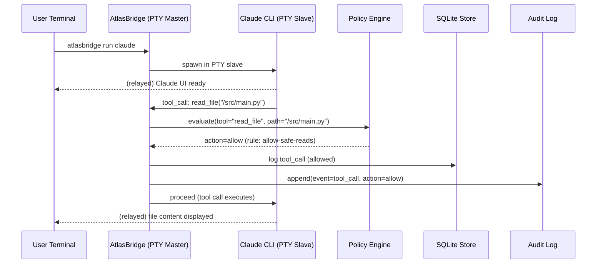
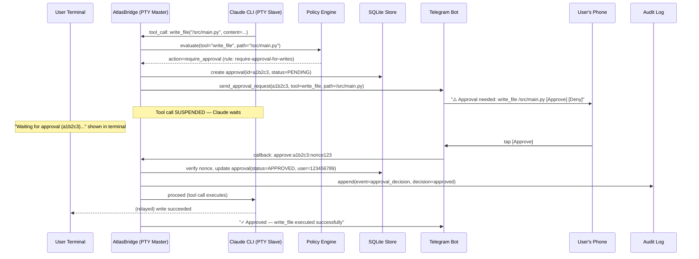
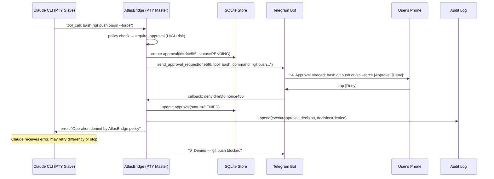
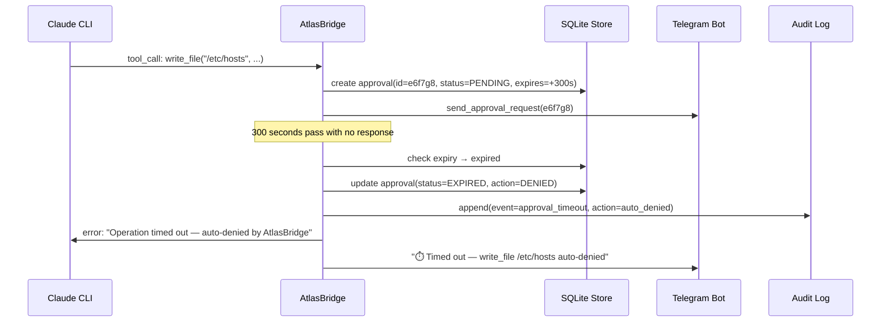
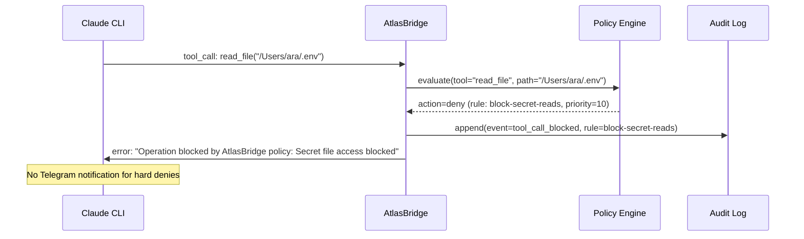
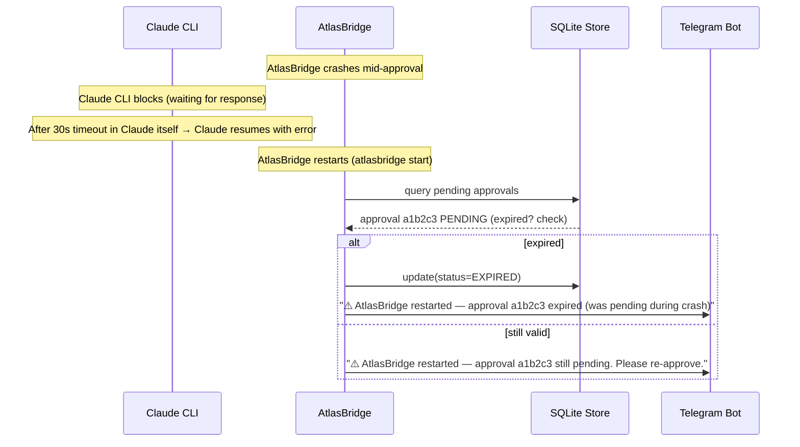
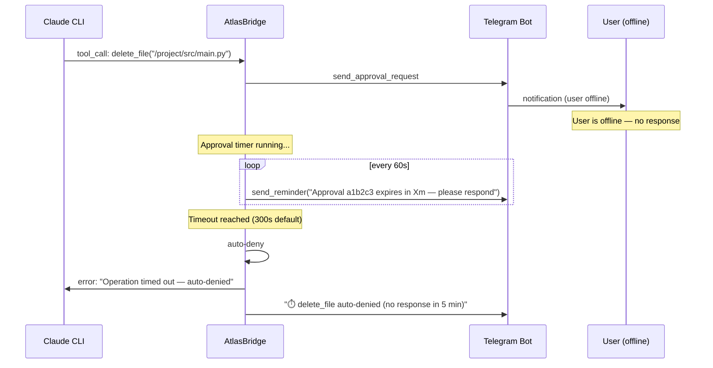

# Tool Interception Design

**Version:** 0.1.0
**Status:** Design
**Last updated:** 2026-02-20

---

## Overview

AtlasBridge must intercept tool calls made by AI agents (Claude Code, OpenAI CLI, etc.) without modifying those agents' code. This document analyzes the available interception strategies, selects the primary approach, and provides sequence diagrams for all key flows.

---

## Interception Strategy Analysis

### Option A: Wrapper (stdin/stdout pipe)

Wrap the AI CLI with a parent process that reads stdout/stderr and writes to stdin:

```
atlasbridge → subprocess(claude) → pipe → atlasbridge interceptor
```

**Pros:**
- Simple to implement
- Works with any subprocess
- No PTY required

**Cons:**
- Loses TTY context: breaks readline, colors, interactive prompts
- Claude Code requires a TTY for interactive use
- Cannot intercept tool calls embedded in binary protocols without parsing

**Verdict:** Fallback only.

---

### Option B: PTY (Pseudo-Terminal) — PRIMARY

Create a PTY pair. The AI CLI runs in the slave PTY; AtlasBridge reads from the master side, intercepts tool calls, and relays I/O to the user's real terminal.

```
User terminal ←→ PTY master (AtlasBridge) ←→ PTY slave (claude)
```

**Pros:**
- AI CLI "thinks" it has a real terminal — full interactive support
- Colors, readline, cursor control all work
- Transparent to the AI CLI
- Tool calls still emitted as structured output on the PTY stream

**Cons:**
- More complex to implement (ptyprocess library)
- Platform-specific (POSIX only; Windows requires WSL)
- Need to parse tool call events from the PTY stream without corrupting display

**Verdict:** PRIMARY approach.

---

### Option C: Plugin / Hook (tool-specific)

Use the AI CLI's own plugin or hook system to intercept tool calls.

**Pros:**
- Cleanest integration; no stream parsing
- Tool call data is already structured
- No PTY or pipe complexity

**Cons:**
- Requires per-tool plugin support (Claude Code does support hooks, but API may change)
- Couples AtlasBridge to each vendor's API
- Less portable

**Verdict:** Supplement to PTY approach where available; not relied upon as primary.

---

### Option D: Local Proxy (HTTP/socket)

Run a local HTTP proxy that intercepts AI API calls before they reach the vendor's API.

**Pros:**
- Can intercept at the API level (before the tool is called)
- Vendor-neutral at the protocol level

**Cons:**
- Requires SSL interception (certificate manipulation)
- High complexity
- Only intercepts calls that go through the proxy; local tools bypass it
- Security risks from cert injection

**Verdict:** Out of scope for MVP.

---

## Selected Approach: PTY with Structured Event Parsing

The PTY adapter wraps the AI CLI in a pseudo-terminal. Tool call events are emitted by the AI CLI as JSON-structured output (per each tool's output protocol). AtlasBridge reads this output from the PTY master, detects tool call events, intercepts them, and decides the outcome before releasing or blocking execution.

### How Claude Code Emits Tool Calls

Claude Code (and similar tools) emit tool call events as structured JSON lines in their output stream when operating in non-interactive scripted or streamed mode. In interactive mode, they use a structured tool output format that AtlasBridge can detect.

AtlasBridge identifies tool call events by:
1. Watching for JSON objects matching the tool call schema
2. Matching against known prefixes/suffixes in the PTY stream
3. Buffering output until a complete event is identified

### I/O Relay Architecture

```
User Terminal
     │
     │ (user keystrokes)
     ▼
┌─────────────────────────────────────────┐
│            PTY Master (AtlasBridge)           │
│                                         │
│  Input relay:                           │
│    user keystrokes → PTY slave          │
│                                         │
│  Output relay:                          │
│    PTY slave output → interceptor       │
│         └─► if tool call event:         │
│               suspend relay             │
│               → policy engine           │
│               → approval (if needed)    │
│               → resume/block            │
│         └─► if regular output:          │
│               relay to user terminal    │
└─────────────────────────────────────────┘
     │
     │ (AI CLI output, relayed)
     ▼
User Terminal display
```

---

## Sequence Diagrams

### 1. Normal Approved Operation



---

### 2. Approval Required — User Approves



---

### 3. Approval Denied



---

### 4. Approval Timeout



---

### 5. Policy Deny (No Approval Required)



---

### 6. Daemon Not Running

```mermaid
sequenceDiagram
    participant U as User
    participant AW as atlasbridge run CLI
    participant D as AtlasBridge Daemon
    participant C as Claude CLI

    U->>AW: atlasbridge run claude
    AW->>D: connect to daemon socket
    D-->>AW: connection refused (daemon not running)
    AW-->>U: Error: AtlasBridge daemon is not running
                 Start it with: atlasbridge start
    Note over C: Claude is NOT launched — fail safe
```

---

### 7. Crash Recovery



---

### 8. User Offline (No Telegram Response)



---

## stdout/stderr Handling

The PTY adapter handles I/O separation:

- **stdout (PTY master → user terminal):** All AI CLI output, including tool call events, flows through here. AtlasBridge reads this stream, extracts tool call events, and relays everything else.
- **stderr:** Captured separately and relayed to the user's stderr. AtlasBridge does not intercept stderr for tool calls.
- **stdin:** User keystrokes are forwarded directly to the PTY slave with no modification.

When a tool call is suspended (awaiting approval):
- User terminal shows: `⏳ Awaiting approval [a1b2c3] — respond on Telegram` (rendered by Rich, not part of PTY stream)
- The AI CLI's output is buffered (not displayed to user) until the decision is made
- On approval: buffered output is flushed to user terminal
- On deny: buffered output is discarded; error message is written to PTY slave's stdin

---

## Subprocess Environment Isolation

The wrapped tool is launched with a sanitized environment:

**Removed from child environment:**
- `ATLASBRIDGE_TELEGRAM_BOT_TOKEN`
- `ATLASBRIDGE_TELEGRAM_ALLOWED_USERS`
- `ATLASBRIDGE_*` (all AtlasBridge config vars)
- `CLAUDE_API_KEY` passthrough is preserved (Claude needs it)

**Added to child environment:**
- `ATLASBRIDGE_SESSION_ID` — session ID for this invocation (read-only, for logging)
- `ATLASBRIDGE_SOCKET_PATH` — path to IPC socket (for plugins, Phase 3)

---

## Signal Handling

| Signal | Source | AtlasBridge behavior |
|--------|--------|----------------|
| SIGINT (Ctrl+C) | User | Forward to Claude CLI; if approval in-flight, notify user; daemon continues |
| SIGTERM | OS / atlasbridge stop | Forward to Claude CLI; drain in-flight approvals (deny after 5s); shutdown |
| SIGPIPE | Broken pipe | Log and exit gracefully |
| SIGHUP | `atlasbridge stop --reload` | Reload config; re-read policy; restart Telegram polling |

**SIGINT detail:**
When the user presses Ctrl+C in an `atlasbridge run` session:
1. SIGINT is forwarded to Claude CLI (which may exit or handle it)
2. AtlasBridge checks for in-flight approvals
3. If no pending approvals: AtlasBridge waits for Claude to exit, then exits itself
4. If pending approvals: warning printed; approvals remain on Telegram (daemon handles them)
5. Daemon is NOT stopped

---

## Streaming Behavior

Claude Code produces streaming output (tokens as they're generated). The PTY adapter must handle streaming correctly:

- Tool call events are emitted as complete JSON objects, not streamed token by token
- The adapter uses a state machine to buffer partial output until a complete JSON event is detected
- Non-event output is relayed with minimal latency (< 5ms target)
- Backpressure: if the approval queue is full, new tool calls are paused (not dropped)

---

## Long-Running Task Behavior

Some tool calls may execute for a long time (e.g., `bash` running tests for 5 minutes). During execution:
- The tool call is logged as `EXECUTING` in the DB
- A timeout can be configured per-operation type
- If the tool call exceeds the execution timeout, AtlasBridge sends SIGTERM to the subprocess
- Audit log records the timeout event

---

## Cancellation Propagation

When a user cancels an operation (via Telegram "Cancel" button or `atlasbridge approvals deny`):
1. Approval status → DENIED
2. PTY adapter writes an error to Claude's stdin: `{"error": "Operation cancelled by user"}`
3. Claude CLI receives the error and handles it (usually stops the current operation)
4. AtlasBridge logs the cancellation in the audit log

---

## Platform Notes

- **macOS / Linux:** PTY approach works natively via `ptyprocess`
- **Windows:** PTY is not natively supported; pipe adapter (Option A) is the fallback; WSL recommended
- **Windows WSL:** PTY works within WSL (Linux environment)

Phase 1 targets macOS and Linux. Windows native support is Phase 4.
